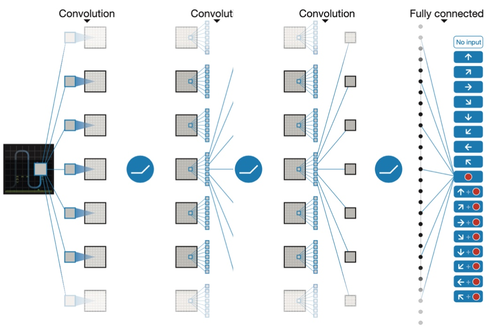
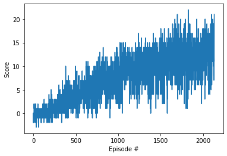
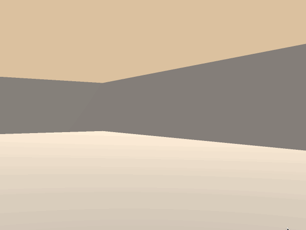

## **Project Report**

**Introduction**

This project uses a navigation system simulated in Unity to train an agent using deep reinforcement learning to achieve a specified goal. Through a series of interactions with the environment, the reinforcement learning agent aims to find the optimal action-value function and follow that policy to maximize the expected discounted cumulative reward.

**Learning Algorithm**

The problem here is set in a continuous space (picking up bananas) with discrete actions. The reinforcement learning agent follows an approximation function representing the environment to learn which appropriate actions are required to achieve certain accumulated rewards.

We used a Deep Q-learning network (DQN) algorithm to approximate the action value function. Specifically, we also utilise two specific optimisation techniques for DDQN uses to help the neural network converge:

1. experience replay
2. fixed Q-target

The two techniques are to solve the performance instability issues due to certain correlations of the DQN structure. In particular, experience replay breaks the correlation between consecutive states by sampling from a pool of past experiences randomly. On the other hand, the fixed Q-target helps the network to reduce correlations between the training action values and the target action values by using fixed weights from previous experience to update the target value.

**Model Architecture**

The model architecture in this project is a Q-network model with three hidden layers and one fully-connected neural network. The activation functions used between each layers are ReLu. Following figure shows the model structure of the Q-network in this project.

**Chosen hyper parameters**

*     batch size = 32
*     buffer size = 100k
*     learning rate alpha = 0.0005
*     soft update learning rate = 0.001
*     discount factor gamma = 0.99
*     min epsilon = 0.01
*     epsilon decay rate = 0.999
*     epsilon start point = 1.0

**Results**

The DQN model solved the problem in 1791 episodes, and scored above 13.01 in 100 episodes. Following figure shows the average score plot.

_**Plot of Rewards**_

_**Agent in training**_

**Ideas for Future Work**

The model can be further improved by further optimization of the hyper parameters to achieve better function approximation. For future work, some techniques such as below can be used to improve agent's performance.

1. Double Deep Q Networks
2. Learning from pixels
3. Dueling Deep Q Networks
